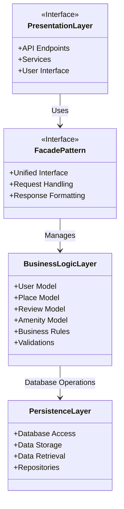

# HBnB Application - High-Level Package Diagram

## Overview
This document presents the three-layer architecture of the HBnB (Holberton BnB) application, demonstrating how different components interact through the Facade pattern.

## Architecture Diagram


## Layer Descriptions

### 1. Presentation Layer (Services, API)
**Responsibilities:**
- Handle HTTP requests and responses
- Expose RESTful API endpoints
- Manage user authentication and authorization
- Format data for client consumption
- Input validation and sanitization

**Key Components:**
- API Routes (e.g., `/users`, `/places`, `/reviews`, `/amenities`)
- Request handlers
- Response formatters
- Authentication services

### 2. Business Logic Layer (Models)
**Responsibilities:**
- Define core business entities and their relationships
- Implement business rules and validations
- Handle application logic
- Manage entity state and behavior

**Key Models:**
- **User**: Represents users of the platform
- **Place**: Represents properties available for rent
- **Review**: Represents user reviews for places
- **Amenity**: Represents features/amenities of places

**Business Rules Examples:**
- User must be authenticated to create a review
- A place must have at least one amenity
- Review ratings must be between 1-5

### 3. Persistence Layer
**Responsibilities:**
- Manage database connections
- Perform CRUD operations (Create, Read, Update, Delete)
- Handle data serialization/deserialization
- Ensure data integrity

**Key Components:**
- Database repositories
- Data access objects (DAOs)
- Database connection management
- Query builders

## Facade Pattern

### Purpose
The Facade Pattern provides a **unified interface** that simplifies communication between the Presentation Layer and the Business Logic Layer.

### How It Works
1. **Request Flow:**
   - Client sends request → Presentation Layer
   - Presentation Layer → Facade
   - Facade → Business Logic Layer
   - Business Logic Layer → Persistence Layer (if needed)

2. **Response Flow:**
   - Persistence Layer → Business Logic Layer
   - Business Logic Layer → Facade
   - Facade → Presentation Layer
   - Presentation Layer → Client

### Benefits
- **Simplification**: Hides complex business logic from the presentation layer
- **Decoupling**: Layers can evolve independently
- **Maintainability**: Changes in one layer don't cascade to others
- **Testability**: Each layer can be tested in isolation

## Communication Pathways

### 1. Presentation ↔ Business Logic (via Facade)
```
API Request → Facade.handle_request() → Model.process() → Return Data
```

### 2. Business Logic ↔ Persistence
```
Model.save() → Repository.create() → Database INSERT
Model.get() → Repository.find() → Database SELECT
```

## Example Workflow: Creating a Review

1. **User submits review** (Presentation Layer)
   - POST request to `/api/places/{id}/reviews`
   
2. **Facade processes request** (Facade Pattern)
   - Validates request format
   - Calls appropriate business logic

3. **Business logic executes** (Business Logic Layer)
   - Review model validates data (rating 1-5, text not empty)
   - Checks if user is authenticated
   - Checks if place exists

4. **Data is persisted** (Persistence Layer)
   - Repository saves review to database
   - Returns confirmation

5. **Response sent back** (via Facade to Presentation)
   - Success/error response formatted
   - Sent back to client

## Design Decisions

### Why Layered Architecture?
- **Separation of Concerns**: Each layer has a specific responsibility
- **Scalability**: Layers can be scaled independently
- **Flexibility**: Easy to swap implementations (e.g., change database)

### Why Facade Pattern?
- **Single Point of Entry**: Simplifies API design
- **Reduced Complexity**: Presentation layer doesn't need to know internal details
- **Consistent Interface**: All requests follow the same pattern

## Future Considerations

- **Caching Layer**: Could be added between Business Logic and Persistence
- **Message Queue**: For asynchronous operations
- **Microservices**: Each model could become its own service
- **API Gateway**: Additional layer for routing and load balancing
